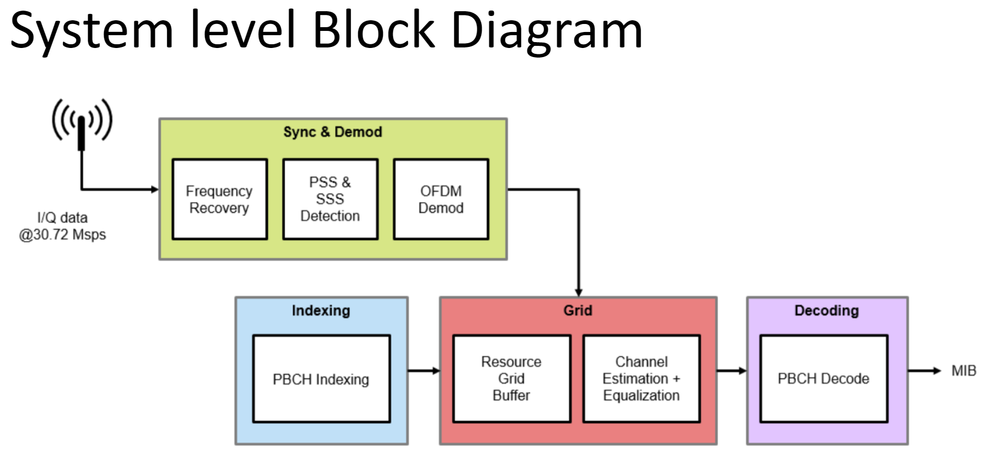

# LTE Cell Search
This system will perform cell search, establishes timing, frequency synchronization and displays cell ID.
<div id="top"></div>


<!-- PROJECT SHIELDS -->
<!--
*** I'm using markdown "reference style" links for readability.
*** Reference links are enclosed in brackets [ ] instead of parentheses ( ).
*** See the bottom of this document for the declaration of the reference variables
*** for contributors-url, forks-url, etc. This is an optional, concise syntax you may use.
*** https://www.markdownguide.org/basic-syntax/#reference-style-links
-->


<!-- PROJECT LOGO -->
<br />
<div align="center">
  <a href="https://github.com/jehigh-sd/LTE_Cell_Search">
    
  </a>

  <p align="center">
    LTE Cell Search algorithm implementation on Xilinx RF SoC.
    <br />
    <a href="https://github.com/jehigh-sd/LTE_Cell_Search"><strong>Explore the docs »</strong></a>
    <br />
    <br />
    <a href="https://github.com/jehigh-sd/LTE_Cell_Search">View Demo</a>
    ·
    <a href="https://github.com/jehigh-sd/LTE_Cell_Search/issues">Report Bug</a>
  </p>
</div>


# Table of Contents
<details open>
<summary><b>Details (click to expand or hide)</b></summary>
<!-- MarkdownTOC -->

1. [About The Project](#about-the-project)
1. [Getting Started](#getting-started)
	1. [RF SoC Details](#rf-soc-details)
	1. [Prerequisites](#prerequisites)
	1. [Installation](#installation)
1. [Documentation](#documentation)
	1. [Synchronization Signals (PSS and SSS)](#Synchronization_Signals)
	1. [MIB Decode Steps](#MIB_Decode_Steps)
1. [Simulation](#Simulation)
1. [Hardware](#Hardware)
	1. [RF SoC](#RF_SoC)
	1. [RF SoC LMX Configuration](#lmx)
	1. [Low Noise Amplifier](#LNA)
1. [IP Blocks](#IP_Blocks)
	1. [Hardware Description](#Hardware_Description)
	1. [LTE Cell Search](#LTE_Cell_Search)
	1. [Simulink Model](#Simulink_model)	
1. [Test Bench](#Test_Bench)
1. [Host software](#Host_Software)
1. [Demo](#demo)
1. [Contributing](#contributing)
1. [Contact](#contact)
1. [Acknowledgments](#acknowledgments)
1. [References](#references)

<!-- /MarkdownTOC -->
</details>


<!-- ABOUT THE PROJECT -->
## About The Project

In this project we will design and develop software for LTE cell search where the LTE signals will be captured with SDR Radio hardware such as Xilinx Zynq-Based Radio RFSOC 2x2.

This system will perform cell search, establishes timing and frequency synchronization and optionally decodes MIB.

Main idea of final project is to establish synchronization with live LTE cells and extract cell ID information, frequency offset, frequency of transmission, received power.

LTE signal will be captured with SDR Radio hardware such as Xilinx Zynq-Based Radio (RF SoC) and this waveform will be decoded to recover basic system information. In LTE the master information block (MIB) is carried within the broadcast channel (BCH). The MIB provides basic cell-wide settings including the system bandwidth and frame number.

The BCH is transmitted in the middle six resource blocks (RBs) of an LTE transmission, therefore a capture bandwidth of only 1.92 MHz is required to decode the MIB, regardless of the cell bandwidth. Only subframe #0 of a frame is required to decode the MIB


<p align="right">(<a href="#top">back to top</a>)</p>


<!-- GETTING STARTED -->
## Getting Started

To get start with your RF Soc visit below page for instructions:

	[Getting started on RF SoC ](https://www.rfsoc-pynq.io/getting_started.html)


### Prerequisites

Matlab 2022a or above is recommened.


  
<!-- RFSOC-DETAILS -->
### RF SoC Details

This section shows RF SoC Image, schematic and details.

* [Image](http://www.pynq.io/board.html)
* [Schematics](https://www.rfsoc-pynq.io/pdf/HTG-ZRF2-XUP_REV_11_Schematic_20Jan21.pdf)
* [User Manual](https://www.rfsoc-pynq.io/pdf/HTG-ZRF2-XUP_REV_11_Schematic_20Jan21.pdf)
* [Accessories](https://www.rfsoc-pynq.io/accessories.html)

<p align="right">(<a href="#top">back to top</a>)</p>


### Installation

For this project, you need to install Xilinx Vitis, Vivado and Matlab

1. Clone the repo
   ```sh
   https://github.com/jehigh-sd/LTE_Cell_Search.git
   ```
2. Install vivado and vitis from below link. For this project, vivado 2020.1 is used
   ```sh
   (https://www.xilinx.com/support/download/index.html/content/xilinx/en/downloadNav/vivado-design-tools/archive.html)
   ```
3. Install Matlab from below link. For this project, Matlab 2022a is used
   ```sh
   (https://www.mathworks.com/support/dws.html)
   ```
4. Copy LMX2594 from this location of this git repo (Hardware/LMX_Settings/LMX2594_491.52.txt) to /usr/local/share/pynq-venv/lib/python3.8/site-packages/xrfclk of RF SoC and restart the RFSoC

<p align="right">(<a href="#top">back to top</a>)</p>

<!-- DEMO -->
<a id="demo"></a>
## Demo:


<p align="right">(<a href="#top">back to top</a>)</p>

<!-- CONTRIBUTING -->
<a id="contributing"></a>
## Contributing:

Contributions are what make the open source community such an amazing place to learn, inspire, and create. Any contributions you make are **greatly appreciated**.

If you have a suggestion that would make this better, please fork the repo and create a pull request. You can also simply open an issue with the tag "enhancement".
Don't forget to give the project a star! Thanks again!

1. Fork the Project
2. Create your Feature Branch (`git checkout -b feature/AmazingFeature`)
3. Commit your Changes (`git commit -m 'Add some AmazingFeature'`)
4. Push to the Branch (`git push origin feature/AmazingFeature`)
5. Open a Pull Request

<p align="right">(<a href="#top">back to top</a>)</p>


<!-- CONTACT -->
## Contact

Your Name - [@your_twitter](https://twitter.com/your_username) - email@example.com

Project Link: [https://github.com/your_username/repo_name](https://github.com/your_username/repo_name)

<p align="right">(<a href="#top">back to top</a>)</p>


<!-- ACKNOWLEDGMENTS -->
## Acknowledgments

We would like acknowledge

* [Vitis HLS Guide](https://pp4fpgas.readthedocs.io/en/latest/)
* [Kastner Research Group] https://kastner.ucsd.edu/

<p align="right">(<a href="#top">back to top</a>)</p>


<!-- REFERENCES -->
## References

* [1]https://www.rfsoc-pynq.io/overlays.html
* [2]https://www.rfsoc-pynq.io/base_overlay.html
* [3]git clone https://github.com/Xilinx/RFSoC2x2-PYNQ.git
* [4]https://github.com/strath-sdr/rfsoc_sam
* [5]https://github.com/strath-sdr/rfsoc_ofdm
* [6]https://www.mathworks.com/help/wireless-hdl/ug/lte-hdl-cell-search.html 
* [7]https://www.mathworks.com/help/lte/ug/synchronization-signals-pss-and-sss.html
* [8]ML Estimation of Time and Frequency Offset in OFDM Systems (IEEE paper)
* [9]https://www.mathworks.com/help/lte/ug/cell-search-mib-and-sib1-recovery.html
* [10]https://www.sharetechnote.com/html/FrameStructure_DL.html#Overview

<p align="right">(<a href="#top">back to top</a>)</p>
