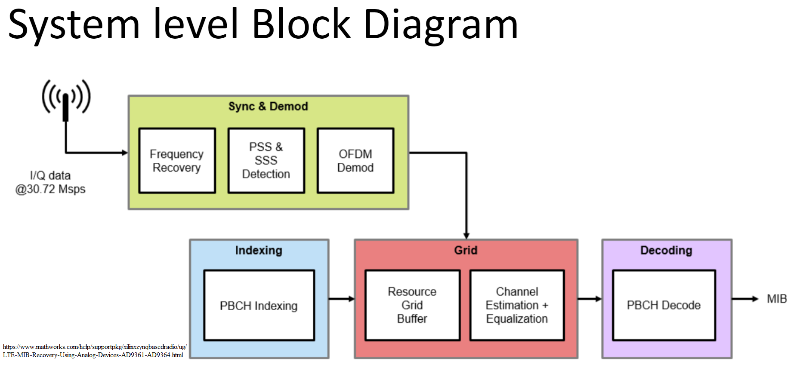

# LTE Cell Search
This system will perform cell search, establishes timing, frequency synchronization and displays cell ID.
<div id="top"></div>


<!-- PROJECT SHIELDS -->
<!--
*** I'm using markdown "reference style" links for readability.
*** Reference links are enclosed in brackets [ ] instead of parentheses ( ).
*** See the bottom of this document for the declaration of the reference variables
*** for contributors-url, forks-url, etc. This is an optional, concise syntax you may use.
*** https://www.markdownguide.org/basic-syntax/#reference-style-links
-->


<!-- PROJECT LOGO -->
<br />
<div align="center">
  <a href="https://github.com/jehigh-sd/LTE_Cell_Search">
    
  </a>

  <p align="center">
    LTE Cell Search algorithm implementation on Xilinx RF SoC.
  </p>
</div>


# Table of Contents
<details open>
<summary><b>Details (click to expand or hide)</b></summary>
<!-- MarkdownTOC -->

1. [About The Project](#about-the-project)
1. [Getting Started](#getting-started)
	1. [RFSoC Details](#rfsoc-details)
	1. [Prerequisites](#prerequisites)
	1. [Installation](#installation)
1. [Synchronization Signals (PSS and SSS)](#Synchronization_Signals)
1. [Hardware](#Hardware)
1. [IP Blocks](#IP_Blocks)
1. [Simulation](#Simulation)
1. [Test Bench](#Test_Bench)
1. [Demo](#demo)
1. [Contact](#contact)
1. [Acknowledgments](#acknowledgments)
1. [References](#references)

<!-- /MarkdownTOC -->
</details>


<!-- ABOUT THE PROJECT -->
## About The Project

In this project we will design and develop software for LTE cell search where the LTE signals will be captured with SDR Radio hardware such as Xilinx Zynq-Based Radio RFSOC 2x2.

This system will perform cell search, establishes timing and frequency synchronization and optionally decodes MIB.

Main idea of final project is to establish synchronization with live LTE cells and extract cell ID information, frequency offset, frequency of transmission, received power.

LTE signal will be captured with SDR Radio hardware such as Xilinx Zynq-Based Radio (RF SoC) and this waveform will be decoded to recover basic system information. In LTE the master information block (MIB) is carried within the broadcast channel (BCH). The MIB provides basic cell-wide settings including the system bandwidth and frame number.

The BCH is transmitted in the middle six resource blocks (RBs) of an LTE transmission, therefore a capture bandwidth of only 1.92 MHz is required to decode the MIB, regardless of the cell bandwidth. Only subframe #0 of a frame is required to decode the MIB


<p align="right">(<a href="#top">back to top</a>)</p>


<!-- GETTING STARTED -->
## Getting Started

To get start with your RF Soc visit below page for instructions:

	(https://www.rfsoc-pynq.io/getting_started.html)

<!-- Prerequisites -->
### Prerequisites

Matlab 2022a or above is recommened.
  
<!-- RFSOC-DETAILS -->
### RFSoC Details

This section shows RF SoC Image, schematic and details.

* [Image](http://www.pynq.io/board.html)
* [Schematics](https://www.rfsoc-pynq.io/pdf/HTG-ZRF2-XUP_REV_11_Schematic_20Jan21.pdf)
* [User Manual](https://www.rfsoc-pynq.io/pdf/RFSoC_2x2_UG.pdf)
* [Accessories](https://www.rfsoc-pynq.io/accessories.html)

<p align="right">(<a href="#top">back to top</a>)</p>

<!-- Installation -->
### Installation

For this project, you need to install Xilinx Vitis, Vivado and Matlab

1. Clone the repo
   ```sh
   https://github.com/jehigh-sd/LTE_Cell_Search.git
   ```
2. Install vivado and vitis from below link. For this project, vivado 2020.2 is used
   ```sh
   (https://www.xilinx.com/support/download/index.html/content/xilinx/en/downloadNav/vivado-design-tools/archive.html)
   ```
3. Install Matlab from below link. For this project, Matlab 2022a is used
   ```sh
   (https://www.mathworks.com/support/dws.html)
   ```
4. Copy LMX2594 from this location of this git repo (Hardware/LMX_Settings/LMX2594_491.52.txt) to /usr/local/share/pynq-venv/lib/python3.8/site-packages/xrfclk of RF SoC and restart the RFSoC

<p align="right">(<a href="#top">back to top</a>)</p>

<!-- Synchronization_Signals -->
<a id="Synchronization_Signals"></a>
## Synchronization_Signals:

Click on below link to see the documentation on the Synchronization_Signals
* [LTE Cell Search Thoery](https://github.com/jehigh-sd/LTE_Cell_Search/blob/main/DOCUMENTATION/LTE_Cell_Search_Thoery.docx)
* [LTE Cell Search 3 Main Components](https://github.com/jehigh-sd/LTE_Cell_Search/blob/main/DOCUMENTATION/LTE_Cell_Search_3_Main_Components.pptx)

<p align="right">(<a href="#top">back to top</a>)</p>

<!-- DEMO -->
<a id="demo"></a>
## Demo:
Click on below link to see the demo presentation on the LTE Cell search

* [LTE Cell Search Project Presentation](https://github.com/jehigh-sd/LTE_Cell_Search/tree/main/DOCUMENTATION/presentation)
* [Jupyter Notebook](https://github.com/jehigh-sd/LTE_Cell_Search/tree/main/NOTEBOOKS)

<p align="right">(<a href="#top">back to top</a>)</p>

<!-- Hardware -->
<a id="Hardware"></a>
## Hardware:

Click on the links to see the documentation on the Board-Level Hardware
* [LTE Cell Search Board-Level Hardware Description](https://github.com/jehigh-sd/LTE_Cell_Search/blob/main/DOCUMENTATION/LTE_Cell_Hardware_Info.docx)
* [Vivado Project](https://github.com/jehigh-sd/LTE_Cell_Search/tree/main/HARDWARE)

<p align="right">(<a href="#top">back to top</a>)</p>

<!-- IP_Blocks -->
<a id="IP_Blocks"></a>
## IP_Blocks:

Click on the links to see the documentation on the Chip-Level Hardware IP Configuration
* [LTE Cell Search Chip-Level Hardware Description](https://github.com/jehigh-sd/LTE_Cell_Search/blob/main/DOCUMENTATION/LTE_Cell_Search_Hardware_Description.pptx)
* [Vitis HLS Projects](https://github.com/jehigh-sd/LTE_Cell_Search/tree/main/HARDWARE/hls_projects)

<p align="right">(<a href="#top">back to top</a>)</p>

<!-- Simulation -->
<a id="Simulation"></a>

## Simulation:

Click on the link to see the simulation files used to verify calculations prior to IP Block implementation
* [MATLAB Simulation](https://github.com/jehigh-sd/LTE_Cell_Search/tree/main/SYSTEMS/Simulation)

<p align="right">(<a href="#top">back to top</a>)</p>

<!-- Test_Bench -->
<a id="Test_Bench"></a>

## Test_Bench:

Click on the links to see the documentation on the Test bench
* [Test Bench Files](https://github.com/jehigh-sd/LTE_Cell_Search/tree/main/TEST_BENCH)
* [How To Enable TestBench](https://github.com/jehigh-sd/LTE_Cell_Search/blob/main/TEST_BENCH/Test_Bench_Procedure.docx)
* [TestBench ReadMe](https://github.com/jehigh-sd/LTE_Cell_Search/blob/main/TEST_BENCH/Readme.txt)

<p align="right">(<a href="#top">back to top</a>)</p>

<!-- CONTACT -->
## Contact

Jeff High - jehigh@ucsd.edu

Project Link: https://github.com/jehigh-sd/LTE_Cell_Search

Capstone Project [Academic Program](https://jacobsschool.ucsd.edu/mas/wes)

<p align="right">(<a href="#top">back to top</a>)</p>


<!-- ACKNOWLEDGMENTS -->
## Acknowledgments

We would like acknowledge

* [Vitis HLS Guide](https://pp4fpgas.readthedocs.io/en/latest/)
* [Kastner Research Group](https://kastner.ucsd.edu/)

<p align="right">(<a href="#top">back to top</a>)</p>


<!-- REFERENCES -->
## References

* [1]https://www.rfsoc-pynq.io/overlays.html
* [2]https://www.rfsoc-pynq.io/base_overlay.html
* [3]https://github.com/Xilinx/RFSoC2x2-PYNQ.git
* [4]https://github.com/strath-sdr/rfsoc_sam
* [5]https://github.com/strath-sdr/rfsoc_ofdm

* [6]https://www.mathworks.com/help/wireless-hdl/ug/lte-hdl-cell-search.html 
* [7]https://www.mathworks.com/help/lte/ug/synchronization-signals-pss-and-sss.html
* [8]https://ieeexplore.ieee.org/document/599949
* [9]https://www.mathworks.com/help/lte/ug/cell-search-mib-and-sib1-recovery.html
* [10]https://www.mathworks.com/help/supportpkg/xilinxzynqbasedradio/ug/LTE-MIB-Recovery-Using-Analog-Devices-AD9361-AD9364.html
* [11]https://www.sharetechnote.com/html/FrameStructure_DL.html#Overview

<p align="right">(<a href="#top">back to top</a>)</p>
